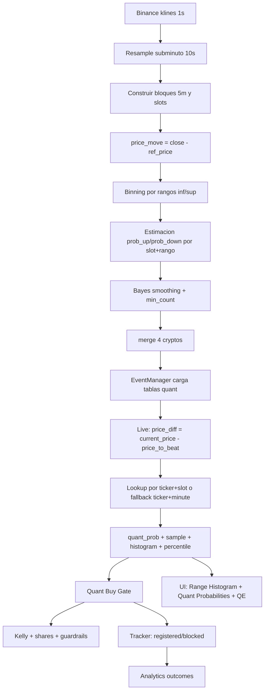

# Quant Probabilities Pipeline

## 1. Objetivo

Este documento describe el pipeline que produce `Quant Probabilities` para eventos de Polymarket, desde datos históricos de Binance hasta señales live (`gate`, `kelly`, `tracking`).

El foco operativo actual es:

- Eventos `5m`
- Datos base `1s`
- Slots de `10s`
- Universo: `BTC`, `ETH`, `SOL`, `XRP`

## 2. Diagrama De Flujo



## 3. Construccion Offline (Research Table)

### Paso A: Exportar velas Binance

Script: `export_binance_klines.py`

Entrada:

- `symbol` (ej. `BTCUSDT`)
- `interval` (`1s`)
- rango temporal

Salida:

- CSV OHLCV con `open_time_utc`, `open`, `high`, `low`, `close`, etc.

### Paso B: Resample subminuto

Script: `resample_klines_to_excel_subminute.py`

Operacion:

- Resample `1s -> 10s` (u otro intervalo)
- Calcula features auxiliares
- Calcula `ts_5m_block` y `slot_in_block`

Salida:

- Excel con hoja `10sec` (u otro intervalo)

### Paso C: Agregar por slot y rango

Script: `aggregate_pm_5m_slot_ranges.py`

Operacion principal:

1. Define bloque de 5 minutos (`_block_key`).
2. Calcula `slot` dentro del bloque.
3. Define referencia del bloque:
   - `ref_price = first(open)` del bloque.
4. Calcula:
   - `price_move = close - ref_price`.
5. Binning por rango:
   - `inf_range = floor(price_move / step) * step`
   - `sup_range = inf_range + step`.
6. Label de outcome por bloque (`event_outcome`):
   - `1.0` si `final_close > ref_price`
   - `0.0` si `final_close < ref_price`
   - `0.5` si empate.
7. Agrega por `slot + inf_range + sup_range`:
   - `prob_up`, `prob_down`, `count_of_klines_inside_range`.
8. Aplica suavizado Bayes opcional (Beta prior).
9. Filtra por `min_count`.

Salida por ticker:

- `*_pm_5m_slot_ranges.csv`
- `*_pm_5m_slot_ranges_mincount_<N>.csv`

### Paso D: Pipeline completo 4 cryptos

Script: `run_pm_pipeline_4cryptos_5m_10s.py`

Orquesta:

1. Export `1s`
2. Resample `10s`
3. Agregacion slot+rango
4. Merge final con columna `ticker`

Salida final:

- `backtest_output/merged_pm_5m_slot_ranges_4cryptos.csv`

## 4. Formulacion Matematica

### 4.1 Slot en bloque 5m

\[
slot = \left\lfloor \frac{seconds\_in\_block}{slot\_seconds} \right\rfloor + 1
\]

### 4.2 Movimiento contra referencia

\[
ref\_price = first(open)\_{block}
\]

\[
price\_move = close - ref\_price
\]

### 4.3 Binning por rango

\[
inf = \left\lfloor \frac{price\_move}{step} \right\rfloor \cdot step,\quad sup = inf + step
\]

### 4.4 Probabilidad por evento de 5m

\[
y_{up}=
\begin{cases}
1 & final\_close > ref\_price \\
0 & final\_close < ref\_price \\
0.5 & final\_close = ref\_price
\end{cases}
\]

\[
prob\_up = \mathbb{E}[y_{up}\mid slot,range],\quad prob\_down = 1 - prob\_up
\]

### 4.5 Bayes smoothing (si activo)

Sea \(n\) el conteo y \(wins = prob\_up \cdot n\):

\[
\hat p_{up} = \frac{wins + \alpha}{n + \alpha + \beta},\quad \hat p_{down}=1-\hat p_{up}
\]

Con defaults del pipeline:

- \(\alpha = 1\)
- \(\beta = 1\)

### 4.6 Percentil actual en histograma

Si el bin actual es \(i\):

\[
pctl = 100 \cdot \frac{\sum_{j<i} n_j + 0.5\,n_i}{\sum_j n_j}
\]

Si el `price_diff` cae fuera por abajo: `0%`.
Si cae fuera por arriba: `100%`.

## 5. Runtime En EventManager

En backend (`EventManager`):

1. Carga tabla 15m:
   - `backtest_output/merged_pm_ranges_4cryptos.csv`
2. Carga tabla 5m-slot (preferida para eventos 5m):
   - `backtest_output/merged_pm_5m_slot_ranges_4cryptos.csv`
3. Para cada tick live:
   - `price_diff = current_price - price_to_beat`
   - Selecciona modelo:
     - `timeframe_minutes == 5` y ticker presente -> `pm_5m_slot_ranges`
     - si no -> `pm_15m_minute_ranges` (fallback)
4. Hace lookup de rango por `bisect`.
5. Publica:
   - `quant_prob_up`
   - `quant_prob_down`
   - `quant_sample_size`
   - `quant_source`
   - `quant_range_histogram`
   - `quant_buy_gate`

## 6. Quant Buy Gate (Reglas)

El gate por lado (`up/down`) evalua:

- `quant_gate_enabled`
- Muestra minima (`quant_gate_min_sample`)
- Edge minimo:
  \[
  edge\% = (quant\_prob - market\_prob)\cdot 100
  \]
- Filtro de precio (`min_price_c`, `max_price_c`)
- Filtro de percentil (`low`, `high`)
- Filtro opcional edge vs ask:
  \[
  ask\_edge\% = (quant\_prob - best\_ask)\cdot 100
  \]

Defaults actuales:

- `min_sample = 120`
- `min_edge_pct = 4.0`
- `percentile_low/high = 15/85`
- `price range = 10c - 90c`
- `edge_vs_ask_enabled = false`
- `min_edge_vs_ask_pct = 2.0`

## 7. De Gate A Ejecucion (Kelly + Guardrails)

Si el lado pasa gate, se evalua stake con Kelly:

\[
raw\_kelly = \max\left(0, \frac{quant\_prob - side\_price}{1 - side\_price}\right)
\]

\[
kelly\_pct = \min(raw\_kelly \cdot kelly\_fraction,\ max\_bet,\ max\_event\_exposure)
\]

\[
stake\_{usd} = kelly\_pct \cdot bankroll,\quad shares = \frac{stake\_{usd}}{side\_price}
\]

Luego aplica restricciones:

- `pm_min_shares`
- `pm_min_notional_usd`
- exposición por evento/ticker
- cooldowns

## 8. Tracking Y Analytics

Cuando un gate pasa de `disabled -> enabled`:

- Si es ejecutable: registra en `opportunities_log.csv`.
- Si no es ejecutable: registra en `opportunity_blocked.csv` con `blocked_reason`.

Al cierre de evento:

- Resuelve `won/loss` en `opportunity_outcomes.csv`.
- Usa regla:
  - `actual_up = close_price >= price_to_beat`.

## 9. Visualizacion En UI

`EventCard` muestra:

- `Range Histogram`:
  - bins, `n`, `pctl`, slot/minuto, fuente (`5m-slot` o `15m-minute`)
- `Quant Probabilities`:
  - `% up (quant)`, `% down (quant)`, `n`
- `QE`:
  \[
  QE = (quantProb - bestAsk)\cdot 100
  \]

## 10. Actualización Diaria (Fin De Día)

Al terminar cada jornada de trading, regenera la tabla quant con los últimos 7 días de datos de Binance y actívala en caliente sin reiniciar el backend.

### Comando rápido

```bash
cd /ruta/a/polymarket-trading-system
bash scripts/update_quant.sh
```

El script hace automáticamente:
1. Descarga datos frescos de Binance (últimos 7 días, 1s klines)
2. Resamplea a slots de 10s
3. Agrega rangos por slot y aplica Bayes smoothing
4. Genera `backtest_output/merged_pm_5m_slot_ranges_4cryptos.csv`
5. Llama a `POST /api/quant/reload` — hot-reload en memoria sin reiniciar el proceso

### Variables opcionales

```bash
# Con más historial (ej. 14 días):
LOOKBACK_DAYS=14 bash scripts/update_quant.sh

# Con API Key activa en el backend:
API_KEY=<tu-key> bash scripts/update_quant.sh

# Ambas:
LOOKBACK_DAYS=14 API_KEY=<tu-key> bash scripts/update_quant.sh
```

### Comando manual equivalente

Si prefieres correrlo paso a paso:

```bash
python3 run_pm_pipeline_4cryptos_5m_10s.py \
  --lookback-days 7 \
  --slot-seconds 10 \
  --range-step 10 \
  --min-count 20 \
  --output-dir backtest_output

# Luego hot-reload (sin API Key):
curl -s -X POST http://localhost:8000/api/quant/reload

# Con API Key:
curl -s -X POST http://localhost:8000/api/quant/reload \
  -H "X-API-Key: <tu-key>"
```

### Endpoint de hot-reload

`POST /api/quant/reload`

- Recarga ambas tablas (`pm_ranges` y `pm_5m_slot_ranges`) desde disco sin detener el backend.
- Responde `{"ok": true, "ranges_tickers": [...], "slot_ranges_tickers": [...]}` en éxito.
- Si falla la lectura del CSV, responde `{"ok": false, "error": "..."}` y mantiene las tablas anteriores en memoria.

### Cuándo correrlo

- Al finalizar el último evento del día (típicamente ~23:55 UTC).
- Después de cambiar parámetros del pipeline (`--lookback-days`, `--min-count`, etc.).
- Cuando sospechas drift del modelo (señales fuera de lo esperado).

## 11. Supuestos Y Limites

- La tabla quant es empírica y depende del lookback usado.
- Si hay drift de mercado, conviene recalcular periódicamente.
- El filtro `min_count` evita bins débiles pero reduce cobertura.
- Resultado live depende de la consistencia entre:
  - `price_to_beat` (fuente del evento)
  - `current_price` (feed de precio activo)
  - `yes/no price` y `best ask` del order book.

## 12. Guia De Scripts (Developer-Oriented)

Esta sección explica los scripts como piezas de una pipeline de datos, no como conceptos financieros.

### 12.1 `export_binance_klines.py`

Que hace:

- Descarga velas OHLCV desde API pública de Binance.
- Soporta uno o varios símbolos.
- Maneja paginación por lotes (`limit=1000`) para cubrir rangos largos.

Entradas clave:

- `--symbol` o `--symbols` o `--four-cryptos`
- `--interval` (`1s`, `1m`, `5m`, etc.)
- ventana temporal (`--start/--end` o `--months`)
- `--output` o `--output-dir`

Salida:

- CSV por símbolo con esquema consistente (`open_time_utc`, `open`, `high`, `low`, `close`, `volume`, ...).

Como pensarlo como developer:

- Es tu `extract` en ETL.
- No aplica lógica quant; solo normaliza y persiste datos crudos de mercado.

Errores comunes:

- Intervalo no soportado.
- Rango temporal inválido (`start >= end`).
- Rate limit/red intermitente.

### 12.2 `resample_klines_to_excel_subminute.py`

Que hace:

- Lee CSV de velas (ej. `1s`).
- Resamplea a intervalos target (`10s`, `30s`, `1m`, ...).
- Añade columnas técnicas útiles para agregación posterior:
  - `ts_5m_block`
  - `slot_in_block`
  - `prob_up/prob_down` rolling (si se usa modo `rolling_columns` en agregación).

Entradas clave:

- `--input` CSV de `export_binance_klines.py`
- `--intervals` (ej. `10s`)
- `--block-minutes` (default `5`)

Salida:

- Archivo Excel multi-hoja (`10sec`, `30sec`, `1min`, etc.).

Como pensarlo como developer:

- Es la capa `transform`.
- Convierte un stream uniforme (`1s`) en vistas agregadas por frecuencia.

Nota:

- Aunque genera `prob_up/prob_down` rolling, en producción actual se prefiere `event_outcome` en la agregación final.

### 12.3 `aggregate_pm_5m_slot_ranges.py`

Que hace:

- Es el núcleo estadístico para `5m`:
  - agrupa por `slot` (dentro del bloque de 5m),
  - agrupa por `range` de movimiento de precio,
  - estima `prob_up/prob_down` empíricas por bucket.

Entradas clave:

- `--input` Excel subminuto
- `--sheet` (`10sec`)
- `--slot-seconds` (default `10`)
- `--range-step` (default `10`)
- `--prob-source` (`event_outcome` recomendado)
- `--bayes-smoothing`, `--prior-alpha`, `--prior-beta`
- `--min-count` y `--output-filtered`

Salida:

- Tabla con schema:
  - `slot, inf_range, sup_range, prob_up, prob_down, count_of_klines_inside_range`
- y versión filtrada por muestra mínima.

Como pensarlo como developer:

- Es un `feature store builder` tabular.
- Materializa un lookup table `state -> probability`.

Por que existe `min_count`:

- Evita buckets con muy pocas observaciones (alto riesgo de sobreajuste).

### 12.4 `run_pm_pipeline_4cryptos_5m_10s.py`

Que hace:

- Orquestador end-to-end para 4 símbolos.
- Ejecuta secuencialmente:
  1. export,
  2. resample,
  3. aggregación,
  4. merge final.

Entradas clave:

- `--lookback-days`
- `--slot-seconds`
- `--range-step`
- `--min-count`

Salida:

- `backtest_output/merged_pm_5m_slot_ranges_4cryptos.csv`

Como pensarlo como developer:

- Es tu comando “build artifact”.
- Si cambias datos o hyperparams, vuelves a correr este script para regenerar la tabla quant.

### 12.5 `aggregate_pm_15m_ranges.py` (fallback legacy)

Que hace:

- Versión equivalente para eventos de 15m (bucket por `minute` en lugar de `slot`).

Cuándo se usa:

- Fallback runtime cuando no hay tabla 5m-slot aplicable.

Salida típica:

- `merged_pm_ranges_4cryptos.csv` (vía flujo legacy).

Como pensarlo como developer:

- Mantiene backward compatibility y continuidad operacional.

## 13. Servicios Runtime Relacionados (No scripts, pero críticos)

### 13.1 `backend/services/event_manager.py`

Responsabilidad:

- Cargar tablas quant en memoria al arrancar.
- En cada tick, calcular contexto actual:
  - `price_diff = current_price - price_to_beat`
  - `current_slot` (si evento 5m)
- Hacer lookup de probabilidad por bucket.
- Construir histograma y percentil actual.
- Aplicar `quant_buy_gate`.
- Publicar updates por WebSocket.

Como pensarlo como developer:

- Es el motor online de inferencia sobre tablas precomputadas.

### 13.2 `backend/services/opportunity_tracker.py`

Responsabilidad:

- Registrar transición de gate (`disabled -> enabled`).
- Separar:
  - señales registradas (`opportunities_log.csv`)
  - oportunidades bloqueadas (`opportunity_blocked.csv`)
- Resolver outcomes al cierre (`opportunity_outcomes.csv`).

Como pensarlo como developer:

- Es auditoría y observabilidad de decisiones.
- Te permite reconstruir funnel y depurar por qué no se ejecutó una oportunidad.

## 14. Flujo Mental Recomendado Para Ti (Developer)

Si quieres depurar de extremo a extremo:

1. Verifica que existe `merged_pm_5m_slot_ranges_4cryptos.csv`.
2. Confirma que el evento live tiene:
   - `timeframe_minutes == 5`
   - ticker mapeado correctamente (`BTC/ETH/SOL/XRP`).
3. Revisa en WS/API que lleguen:
   - `quant_source`
   - `quant_prob_up/down`
   - `quant_range_histogram.current_percentile`
   - `quant_buy_gate.reasons`
4. Si no hay señal:
   - primero valida `quant_gate` (sample/edge/percentile/price),
   - luego `kelly + pm_min_*`,
   - luego `bot_risk_*`.

Esto te da un orden de debugging determinista y reproducible.

## 15. Glosario (Finanzas/Trading)

- `OHLCV`: formato de vela con `Open`, `High`, `Low`, `Close`, `Volume`.
- `Kline/Candle`: barra temporal de precio (ej. 1s, 10s, 1m).
- `Ticker`: símbolo del activo (`BTC`, `ETH`, etc.).
- `Order Book`: libro de órdenes activas por precio.
- `Bid`: mejor precio de compra disponible.
- `Ask`: mejor precio de venta disponible.
- `Spread`: diferencia entre mejor `ask` y mejor `bid`.
- `Market Order`: orden que ejecuta al mejor precio disponible.
- `Limit Order`: orden con precio máximo/mínimo definido por el usuario.
- `Fill`: ejecución real de una orden (total o parcial).
- `Notional`: valor monetario de la operación (`precio * cantidad`).
- `Shares`: cantidad de contratos/participaciones compradas.
- `Slippage`: diferencia entre precio esperado y precio real de ejecución.
- `Exposure`: capital comprometido (por evento, ticker o total).
- `Bankroll`: capital base usado para sizing/riesgo.
- `Probability (market_prob)`: probabilidad implícita por precio de mercado (en PM suele mapearse a centavos).
- `Quant Probability`: probabilidad estimada por el modelo/tablas históricas.
- `Edge`: ventaja estimada del modelo sobre mercado:
  - `edge% = (quant_prob - market_prob) * 100`.
- `Edge vs Ask`: ventaja del modelo contra el mejor precio de compra ejecutable:
  - `ask_edge% = (quant_prob - best_ask) * 100`.
- `Percentile (pctl)`: posición relativa del `price_diff` dentro del histograma histórico del bucket actual.
- `Bucket`: grupo discreto de estados (ej. `slot + range`) usado para lookup.
- `Sample Size (n)`: número de observaciones históricas en un bucket.
- `Bayes Smoothing`: ajuste de probabilidades con prior para evitar extremos en buckets con poca muestra.
- `Gate`: conjunto de reglas de habilitación de oportunidad (sample, edge, precio, percentil, etc.).
- `Guardrail`: regla de protección de riesgo/ejecución (mínimos de exchange, cooldown, caps).
- `Cooldown`: tiempo mínimo entre ejecuciones para evitar ráfagas.
- `Cap`: límite máximo de exposición permitido.
- `PnL`: Profit and Loss (ganancia/pérdida monetaria).
- `Hit Rate`: porcentaje de señales que terminaron en acierto.
- `Drawdown`: caída acumulada desde un pico de capital (métrica de riesgo, no siempre mostrada en UI).
