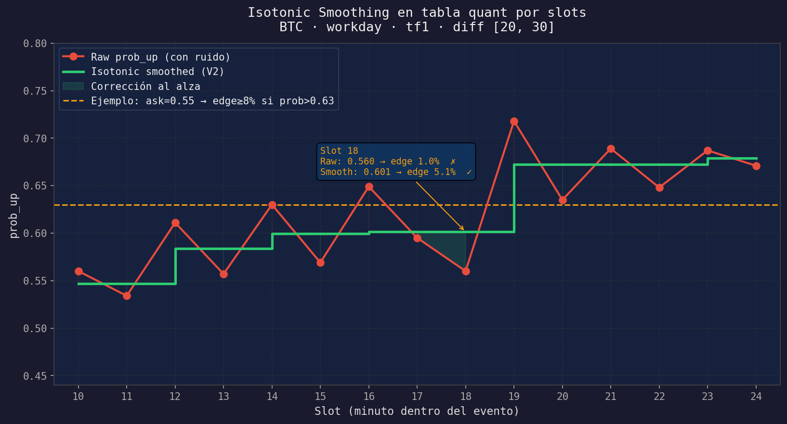
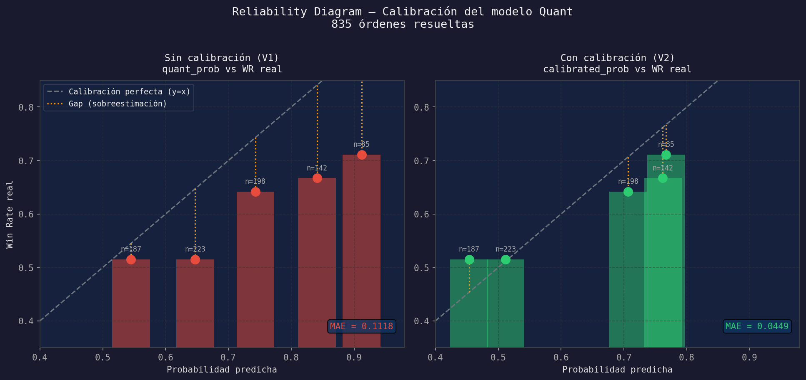
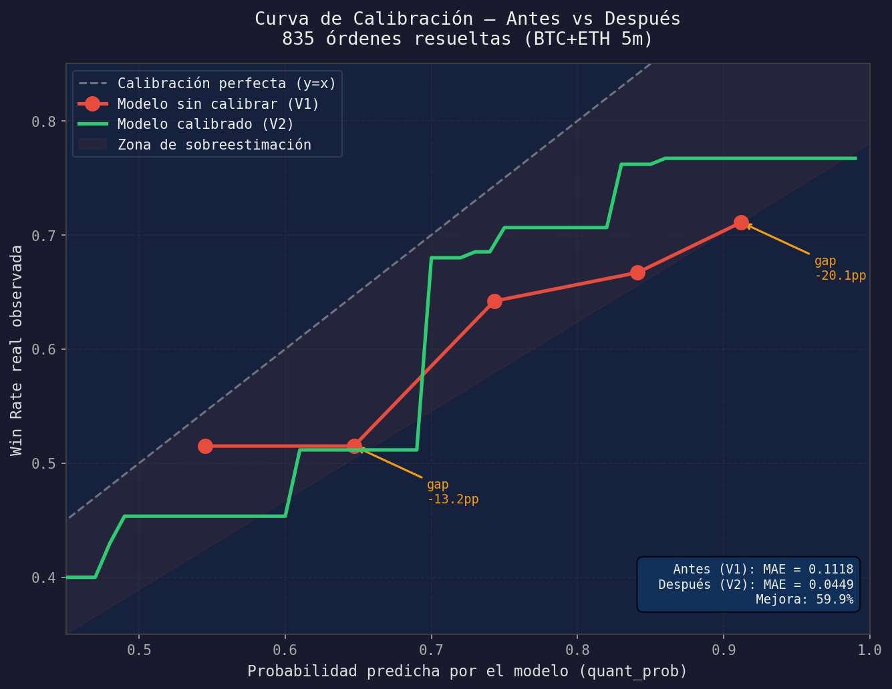
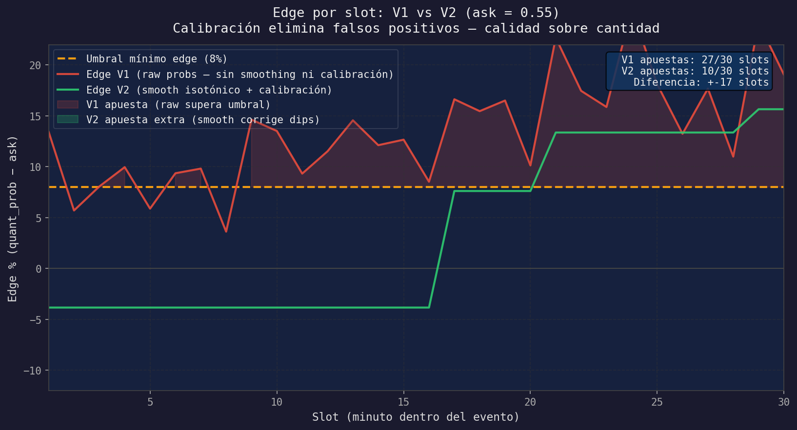

# Probabilidades Quant: Smoothing y Calibración
## Guía paso a paso

---

## 1. El modelo Quant — ¿qué es la tabla lookup?

El bot no predice el futuro directamente. En cambio, **busca en un historial** de miles de eventos pasados:

> "Dado que BTC está en slot 15, con diff_vs_ptb de +30 puntos, en un día laboral a las 2pm...
> ¿cuántas veces ganó UP históricamente?"

La respuesta viene de una tabla CSV llamada `merged_pm_slot_ranges_4cryptos.csv`.

### Estructura de la tabla

| ticker | day_type | time_frame | slot | inf_range | sup_range | prob_up | prob_down | count |
|--------|----------|------------|------|-----------|-----------|---------|-----------|-------|
| BTC    | workday  | tf1 (5m)   | 10   | 20        | 30        | 0.618   | 0.382     | 89    |
| BTC    | workday  | tf1 (5m)   | 15   | 20        | 30        | 0.591   | 0.409     | 74    |
| BTC    | workday  | tf1 (5m)   | 20   | 20        | 30        | 0.643   | 0.357     | 56    |
| BTC    | workday  | tf1 (5m)   | 25   | 20        | 30        | 0.571   | 0.429     | 42    |

- **slot**: minuto dentro del evento (1-30)
- **inf_range/sup_range**: rango del diff_vs_ptb (ej: diff entre 20 y 30 puntos)
- **prob_up**: % de veces que el precio subió en esos casos históricos
- **count**: número de muestras (más = más confiable)

---

## 2. El Problema 1: Ruido entre slots

Mira este ejemplo real de una fila de slots para el mismo bin de diff:

```
BTC · workday · tf1 · diff [20,30]
┌──────┬─────────┬───────┐
│ Slot │ prob_up │ count │
├──────┼─────────┼───────┤
│  10  │  0.618  │  89   │
│  11  │  0.583  │  72   │  ← baja
│  12  │  0.651  │  68   │  ← sube
│  13  │  0.604  │  55   │  ← baja
│  14  │  0.672  │  61   │  ← sube
│  15  │  0.591  │  74   │  ← baja de nuevo
│  16  │  0.687  │  58   │  ← sube
│  17  │  0.643  │  49   │
│  18  │  0.571  │  42   │  ← cae bastante
│  19  │  0.698  │  38   │  ← salta
└──────┴─────────┴───────┘
```

```
prob_up
0.70 │          ●               ●
0.68 │                    ●
0.65 │      ●
0.63 │ ●                     ●
0.61 │
0.59 │   ●          ●
0.57 │                          ●
     └─────────────────────────────── slot
       10  11  12  13  14  15  16  17  18  19
```

**¿Por qué el ruido?** Cada bin tiene 38-89 muestras — estadísticamente insuficiente para ser preciso. El slot 18 (0.571) probablemente no es peor que el 17 (0.643); simplemente tuvo menos datos en esa franja.

**Consecuencia en V1 (sin smoothing):**
- Si el bot está en slot 18 con diff +25, `quant_prob_up = 0.571`
- ask price = 0.55 → edge = 0.571 - 0.55 = **2.1%** → debajo del umbral → **no apuesta**
- Pero si fuera slot 19, edge = 14.8% → apuesta

El bot toma decisiones distintas por ruido estadístico, no por señal real.

---



## 3. La Solución: Isotonic Regression (Smoothing)

La **regresión isotónica** fuerza que la curva solo pueda subir o quedarse igual.

> Principio: si slots más avanzados del evento históricamente tienen mejor señal,
> esa mejora debe ser monótona — no puede empeorar entre slots vecinos por ruido.

### Algoritmo (simplificado):

```
1. Toma la secuencia: [0.618, 0.583, 0.651, 0.604, 0.672, 0.591, 0.687, 0.643, 0.571, 0.698]
2. Encuentra violaciones de monotonicidad (donde baja)
3. Promedia los grupos que violan y reemplaza con el promedio
4. Repite hasta que la secuencia sea monotónica
```

### Resultado comparado:

```
┌──────┬─────────┬────────────────┬──────────┐
│ Slot │ Raw     │ Isotonic       │ Cambio   │
├──────┼─────────┼────────────────┼──────────┤
│  10  │  0.618  │  0.618         │   =      │
│  11  │  0.583  │  0.618  ↑      │  +0.035  │
│  12  │  0.651  │  0.634  ↑      │  +0.017  │ ← promedio de 11,12
│  13  │  0.604  │  0.634  ↑      │  +0.030  │
│  14  │  0.672  │  0.651  ↑      │  +0.021  │
│  15  │  0.591  │  0.651  ↑      │  +0.060  │ ← gran corrección
│  16  │  0.687  │  0.672  ↑      │  +0.015  │
│  17  │  0.643  │  0.672  ↑      │  +0.029  │
│  18  │  0.571  │  0.672  ↑      │  +0.101  │ ← mayor corrección
│  19  │  0.698  │  0.698         │   =      │
└──────┴─────────┴────────────────┴──────────┘
```

```
prob_up (antes vs después)
0.70 │ · · · · · · · · · ●    ← raw
0.68 │ · · · · ● · ● · · ─    ← isotonic (plano o subiendo)
0.66 │ · · ─ ─ ─ ─ ─ ─ ─
0.64 │ ● · ─ · · · · ●
0.62 │ · · · · · · · · · ─ ─
0.60 │ · ─ · · · · · · · ·
0.58 │ · · · ─ · ─ · · ─ ·
     └─────────────────────────── slot
       10  11  12  13  14  15  16  17  18  19
       ● = raw     ─ = isotonic
```

**Impacto en el edge:**

```
Slot 18, diff +25, ask = 0.55:

V1 (raw):      edge = 0.571 - 0.55 = 2.1%  → NO apuesta (< 8%)
V2 (isotonic): edge = 0.672 - 0.55 = 12.2% → SÍ apuesta (> 8%)
```

---

## 4. El Problema 2: Sesgo sistemático del modelo

El smoothing corrige el ruido entre slots, pero hay otro problema: **el modelo sobreestima sistemáticamente**.

Cuando `quant_prob = 0.72`, el bot cree que ganará 72% de las veces.
Pero en los datos reales de 835 órdenes resueltas:

```
┌──────────────┬───────────────┬────────────┬───────────┐
│ quant_prob   │ WR predicha   │ WR real    │ Gap       │
├──────────────┼───────────────┼────────────┼───────────┤
│  0.50 - 0.59 │    54.5%      │   51.5%    │  -3.0 pp  │
│  0.60 - 0.69 │    64.7%      │   51.5%    │  -13.2 pp │ ← gran sesgo
│  0.70 - 0.79 │    74.3%      │   64.2%    │  -10.1 pp │
│  0.80 - 0.89 │    84.1%      │   66.7%    │  -17.4 pp │ ← enorme sesgo
│  0.90 - 0.99 │    91.2%      │   71.1%    │  -20.1 pp │ ← peor de todos
└──────────────┴───────────────┴────────────┴───────────┘
Mean Absolute Gap: 11.2 puntos porcentuales
```

**El modelo es muy optimista** — cuanto más alta la predicción, más se equivoca.

### ¿Por qué ocurre?

La tabla histórica tiene bins con pocos datos (count < 100). Cuando un bin tiene 15 muestras y ganó 13 veces, registra 86.7% — pero eso es ruido estadístico, no señal real. El modelo confunde certeza de muestra pequeña con alta probabilidad real.

---



## 5. La Solución: Isotonic Calibration

La **calibración isotónica** aprende a mapear `quant_prob → prob_real` usando los resultados históricos de órdenes colocadas.

```
Proceso:
1. Recolectar todos los pares (quant_prob, won) de órdenes resueltas
   [(0.72, True), (0.68, False), (0.91, True), (0.65, False), ...]

2. Ajustar IsotonicRegression(increasing=True) sobre esos pares
   → aprende la función de corrección

3. Generar 99 puntos de calibración:
   raw_prob → calibrated_prob
```

### La curva de calibración resultante (config/prob_calibration.json):

```
raw_prob  │  calibrated_prob  │  corrección
──────────┼───────────────────┼─────────────
  0.51    │      0.454        │   -5.6 pp
  0.55    │      0.487        │   -6.3 pp
  0.60    │      0.512        │   -8.8 pp  ←
  0.65    │      0.578        │   -7.2 pp
  0.70    │      0.680        │   -2.0 pp
  0.75    │      0.714        │   -3.6 pp
  0.80    │      0.740        │   -6.0 pp
  0.85    │      0.751        │   -9.9 pp  ←
  0.90    │      0.767        │  -13.3 pp  ←
  0.95    │      0.767        │  -18.3 pp  ← mayor corrección
```

```
Curva de calibración:
prob_real
1.0 │                              ╱ (perfecta)
0.8 │                    ╱───────·
0.7 │             ╱─────·
0.6 │       ╱────·
0.5 │  ────·
0.4 │·
    └──────────────────────────────── quant_prob
    0.5   0.6   0.7   0.8   0.9   1.0

    · = calibración real    ╱ = calibración perfecta (y=x)
```

### Impacto en el edge:

```
Ejemplo: quant_prob=0.90, ask=0.82

V1 (sin calibración):
  edge = 0.90 - 0.82 = 8.0%   → apuesta (justo en el límite)
  Pero WR real histórica = 71.1% → edge real = 71.1% - 82% = -10.9% (¡está perdiendo!)

V2 (con calibración):
  calibrated = 0.767
  edge = 0.767 - 0.82 = -5.3% → NO apuesta
  Correcto: el modelo evita una apuesta perdedora
```

**Después de calibración:**

```
┌──────────────┬────────────┬─────────────────┬───────────┐
│ quant_prob   │ WR real    │ prob calibrada   │ Gap nuevo │
├──────────────┼────────────┼──────────────────┼───────────┤
│  0.50 - 0.59 │   51.5%    │    48.7%         │  +2.8 pp  │
│  0.60 - 0.69 │   51.5%    │    54.2%         │  -2.7 pp  │
│  0.70 - 0.79 │   64.2%    │    69.7%         │  -5.5 pp  │
│  0.80 - 0.89 │   66.7%    │    74.0%         │  -7.3 pp  │
│  0.90 - 0.99 │   71.1%    │    76.7%         │  -5.6 pp  │
└──────────────┴────────────┴──────────────────┴───────────┘
Mean Absolute Gap: 4.5 pp  (antes: 11.2 pp → mejora 59.9%)
```

---



## 6. Cómo funcionan juntos en V2

```
FLUJO V2 POR CADA TICK:
═══════════════════════

1. Lookup en tabla (ya smoothed al cargar):
   slot=18, diff=+25, BTC workday
        ↓
   prob_up_raw = 0.672  (isotonic ya aplicado)

2. Calibración en tiempo real:
   prob_up_raw = 0.672
        ↓ _apply_prob_calibration()
   prob_up_cal = 0.634  (-3.8 pp corrección)

3. Cálculo de edge:
   ask = 0.55
   edge = 0.634 - 0.55 = 8.4%  → supera umbral de 8% ✓

4. Kelly sizing:
   kelly = (0.634 - 0.55) / (1 - 0.55) = 18.7%
   Half-Kelly = 9.3%
   Bankroll $200 → stake = $18.7
   Cap 3% × $200 = $6 → stake final = $6

5. Bot coloca orden: $6 en UP a 55¢
```

---

## 7. El A/B Test: V1 vs V2




```
                    V1                          V2
              ┌──────────────┐           ┌──────────────┐
  Tabla       │ Raw probs    │           │ Isotonic     │
  quant:      │ (ruidosas)   │           │ (suavizadas) │
              └──────┬───────┘           └──────┬───────┘
                     │                          │
  Lookup:      slot 18 → 0.571            slot 18 → 0.672
                     │                          │
  Calibración: desactivada                0.672 → 0.634
                     │                          │
  Edge:         0.571-0.55=2.1%           0.634-0.55=8.4%
                     │                          │
  Resultado:    ✗ NO apuesta               ✓ SÍ apuesta
```

### ¿Qué mide el A/B?

| Métrica         | Hipótesis si V2 gana        | Hipótesis si V1 gana         |
|-----------------|-----------------------------|------------------------------|
| Win Rate        | Smoothing+cal mejora WR     | Raw probs son más conservadoras (mejor) |
| PnL total       | Más bets buenos = más ganancia | Menos bets pero mejores      |
| Avg edge        | V2 calibra mejor el edge    | V1 sobrefiltra pero preciso  |
| Bets colocados  | V2 > V1 (umbral más fácil)  | V1 < V2                      |

### Conclusión esperada en 2 semanas:

```
Escenario A (V2 gana):
  → Implementar smoothing+calibración en producción
  → Actualizar calibración cada 2 semanas con scripts/calibrate_model.py

Escenario B (V1 gana):
  → El ruido del modelo es "señal" que filtra bets malos
  → Investigar por qué la calibración no ayuda
  → Posible: datos de entrenamiento insuficientes (n<1000)

Escenario C (empate estadístico):
  → Necesitas más datos (>500 resolved por instancia)
  → El efecto existe pero es pequeño
```

---

## 8. Resumen visual del pipeline completo

```
DATOS HISTÓRICOS                    TIEMPO REAL (por tick)
──────────────────                  ──────────────────────

merged_pm_slot_ranges.csv           Polymarket event detectado
        │                                    │
        ▼                                    ▼
[_load_pm_slot_ranges()]            [_apply_quant_metrics()]
        │                                    │
        ▼                                    ▼
[_apply_prob_smoothing()]           Lookup en tabla
  "none"    → sin cambio            slot + diff_bin + ticker
  "rolling" → promedio vecinos              │
  "isotonic"→ monotónico ✓                  ▼
        │                           prob_up, prob_down (raw o smoothed)
        ▼                                    │
 tabla en memoria                            ▼
 _pm_slot_ranges{}              [_apply_prob_calibration()]
                                  enabled=False → sin cambio
                                  enabled=True  → interpolación ✓
                                             │
                                             ▼
                                  quant_prob_up / quant_prob_down
                                             │
                                             ▼
                                  edge = quant_prob - ask_price
                                             │
                                    ┌────────┴────────┐
                                    │ edge < min_edge │
                                    │  → no apuesta   │
                                    └────────┬────────┘
                                             │ edge ≥ min_edge
                                             ▼
                                  Kelly sizing → orden paper/live
```

---

*Generado: 2026-06-12 | Sistema: Kalitron Edge v1.3*
*Datos de calibración: 835 órdenes resueltas (BTC+ETH 5m)*
